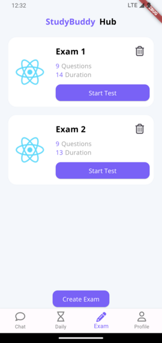

# StudyBuddyHub

StudyBuddyHub is a mobile application that provides students with an interactive learning experience. It features a platform powered by Google Gemini artificial intelligence, allowing students to study, ask questions, and interact with other users in an innovative environment.

## Features

### 1. Home Chat Window
The application's main screen features a chat window integrated with Google Gemini. This enables users to chat, ask questions, and seek instant help through images to learn new things.


### 2. Daily Goal Tracking
We have added a special screen to our application where students can set daily goals and track the number of questions they solve in line with these goals. This allows students to monitor their progress towards their set targets on a daily basis, enhancing their motivation.


### 3. Exam Creation from Lecture Notes
Google Gemini AI helps users create exams automatically by taking a photo of their lecture notes. This feature provides students with an effective way to learn and prepare for exams.




## Installation


1. Clone the repository:
 
   ```bash
   git clone https://github.com/your_name/StudyBuddyHub.git
 
2. Navigate to the project directory:

    ```
    cd StudyBuddyHub
    
 
3. Install the required dependencies:

    ```
    flutter pub get
    

4. Run the application:

    ```
        flutter run 
    

## Contribution
If you would like to contribute to the application, please refer to the [CONTRIBUTING.md](CONTRIBUTING.md) file. Your contributions are welcome!


## License
This project is licensed under the MIT License.

## Version
1.0.0
